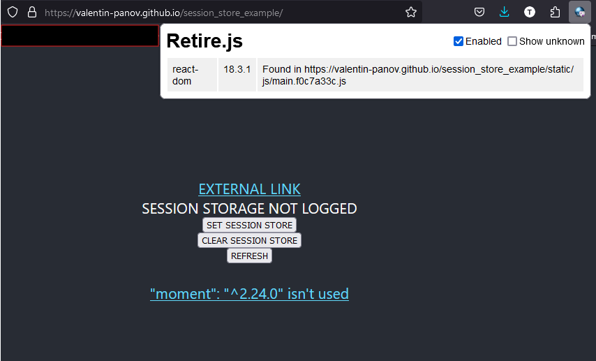

# session_store_example

### web version: https://valentin-panov.github.io/session_store_example/

## v.0.1.1

### injected https://security.snyk.io/package/npm/moment/2.24.0

and if it is used in the scripts, it will appear:

And if the scripts don't import the vulnerable package, the bundler will exclude it during the build process.
